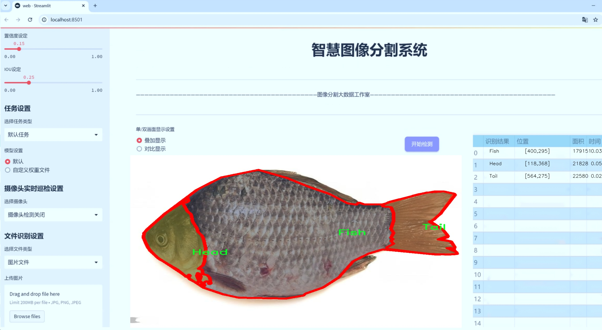
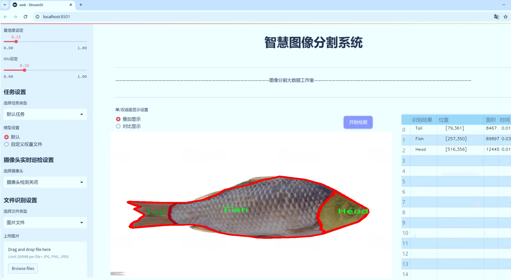
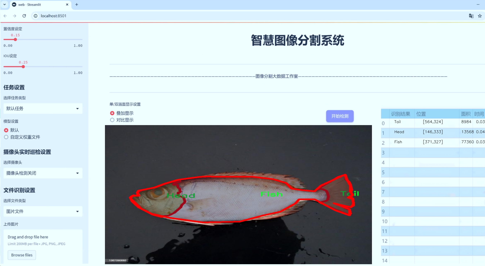
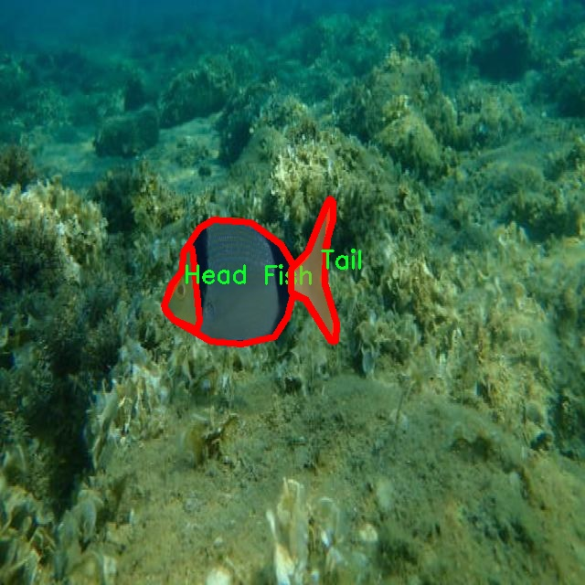
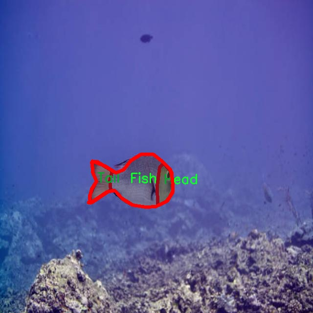
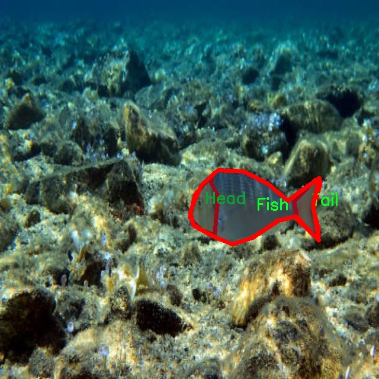
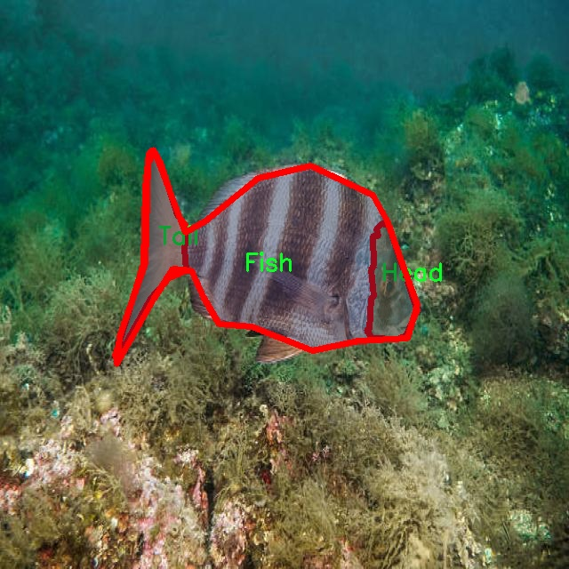
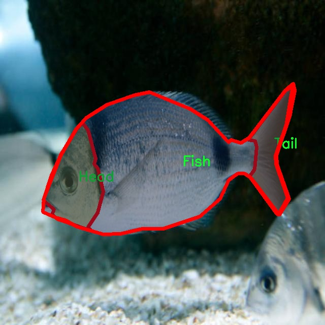

# 鱼类部位分割系统： yolov8-seg-goldyolo

### 1.研究背景与意义

[参考博客](https://gitee.com/YOLOv8_YOLOv11_Segmentation_Studio/projects)

[博客来源](https://kdocs.cn/l/cszuIiCKVNis)

研究背景与意义

随着全球水产养殖业的快速发展，鱼类作为重要的水产品，其品质和安全性日益受到关注。鱼类的部位分割不仅对水产品的加工和销售具有重要意义，还在生态保护、物种识别及生物多样性研究中扮演着关键角色。传统的鱼类部位分割方法多依赖于人工标注和经验判断，效率低下且容易受到主观因素的影响。近年来，深度学习技术的迅猛发展为图像处理领域带来了新的机遇，尤其是目标检测和实例分割任务中，基于卷积神经网络（CNN）的算法表现出色。

在众多深度学习模型中，YOLO（You Only Look Once）系列因其高效的实时检测能力而备受青睐。YOLOv8作为该系列的最新版本，结合了多种先进的网络结构和算法优化，具备了更强的特征提取能力和更快的推理速度。然而，尽管YOLOv8在一般目标检测任务中表现优异，但在鱼类部位分割这一特定应用场景中，仍然存在一些挑战。例如，鱼类的形态多样性、部位之间的相似性以及背景复杂性等因素，都会影响模型的分割精度。因此，基于YOLOv8的改进策略将为鱼类部位分割提供新的解决方案。

本研究所使用的数据集“Eskiveriseti”包含2400张标注图像，涵盖了鱼类的三个主要部位：鱼体、头部和尾部。该数据集的构建为模型训练和评估提供了丰富的样本基础，能够有效提升模型的泛化能力和分割精度。通过对该数据集的深入分析，我们可以识别出不同部位的特征，进而优化YOLOv8的网络结构和损失函数，使其更适应于鱼类部位的细粒度分割任务。此外，针对数据集中不同类别样本的不均衡性，我们还将引入数据增强技术，以提高模型对少数类的识别能力。

本研究的意义不仅在于提升鱼类部位分割的准确性和效率，更在于推动水产行业的智能化发展。通过构建高效的鱼类部位分割系统，能够为水产品的自动化加工提供技术支持，减少人工成本，提高生产效率。同时，该系统也为生态监测和物种保护提供了重要的技术手段，有助于实现可持续发展目标。通过对鱼类部位的精准识别与分析，我们能够更好地了解鱼类的生长习性、繁殖行为及其在生态系统中的作用，从而为生态保护和资源管理提供科学依据。

综上所述，基于改进YOLOv8的鱼类部位分割系统的研究，不仅具有重要的学术价值，还有着广泛的应用前景。通过这一研究，我们希望能够推动深度学习技术在水产领域的应用，为实现水产养殖的智能化和可持续发展贡献力量。

### 2.图片演示







注意：本项目提供完整的训练源码数据集和训练教程,由于此博客编辑较早,暂不提供权重文件（best.pt）,需要按照6.训练教程进行训练后实现上图效果。

### 3.视频演示

[3.1 视频演示](https://www.bilibili.com/video/BV1PmzuYgEfn/)

### 4.数据集信息

##### 4.1 数据集类别数＆类别名

nc: 3
names: ['Fish', 'Head', 'Tail']


##### 4.2 数据集信息简介

数据集信息展示

在本研究中，我们使用了名为“Eskiveriseti”的数据集，以支持对鱼类部位的精确分割，特别是针对YOLOv8-seg模型的改进。该数据集专门设计用于训练和评估鱼类部位分割系统，涵盖了三种主要类别，分别是“Fish”、“Head”和“Tail”。这些类别的选择不仅反映了鱼类解剖结构的基本组成部分，也为我们提供了足够的多样性，以确保模型在不同情况下的鲁棒性和准确性。

“Eskiveriseti”数据集的构建考虑到了多种鱼类的形态特征，确保了数据的代表性和广泛性。数据集中包含了多种鱼类的图像，涵盖了不同的环境和光照条件，旨在模拟实际应用中可能遇到的各种情况。这种多样性对于训练深度学习模型至关重要，因为它能够帮助模型学习到更具泛化能力的特征，从而在未见过的样本上也能表现出色。

在数据标注方面，数据集采用了高精度的标注技术，确保每个类别的边界都得到了准确的划分。对于“Fish”类别，标注不仅包括整个鱼体的轮廓，还特别关注了鱼头和鱼尾的细节，以便于后续的分割任务。通过这种精细的标注，我们的模型能够在训练过程中学习到鱼类各个部位之间的相互关系和特征，从而提高分割的精确度。

在数据集的规模方面，“Eskiveriseti”提供了足够数量的样本，以支持深度学习模型的训练和验证。每个类别的样本数量经过精心设计，确保模型在学习过程中不会因类别不平衡而产生偏差。通过对数据集的合理划分，我们可以有效地进行训练集、验证集和测试集的构建，从而全面评估模型的性能。

此外，数据集还考虑到了不同鱼类的形态变化，包括不同年龄段、性别及生长环境的影响。这种细致的分类使得模型能够更好地适应不同的应用场景，如水产养殖、生态监测等领域。在实际应用中，鱼类的部位分割不仅有助于科学研究，还能为渔业管理提供数据支持，促进可持续发展。

总之，“Eskiveriseti”数据集为改进YOLOv8-seg的鱼类部位分割系统提供了坚实的基础。通过对数据集的深入分析和应用，我们期望能够提升模型在鱼类部位分割任务中的表现，实现更高的准确性和效率。这一数据集的使用，不仅为学术研究提供了重要的实验基础，也为实际应用中的鱼类监测和管理提供了有效的技术支持。











### 5.项目依赖环境部署教程（零基础手把手教学）

[5.1 环境部署教程链接（零基础手把手教学）](https://www.bilibili.com/video/BV1jG4Ve4E9t/?vd_source=bc9aec86d164b67a7004b996143742dc)


[5.2 安装Python虚拟环境创建和依赖库安装视频教程链接（零基础手把手教学）](https://www.bilibili.com/video/BV1nA4VeYEze/?vd_source=bc9aec86d164b67a7004b996143742dc)

### 6.手把手YOLOV8-seg训练视频教程（零基础手把手教学）

[6.1 手把手YOLOV8-seg训练视频教程（零基础小白有手就能学会）](https://www.bilibili.com/video/BV1cA4VeYETe/?vd_source=bc9aec86d164b67a7004b996143742dc)


按照上面的训练视频教程链接加载项目提供的数据集，运行train.py即可开始训练



     Epoch   gpu_mem       box       obj       cls    labels  img_size
     1/200     0G   0.01576   0.01955  0.007536        22      1280: 100%|██████████| 849/849 [14:42<00:00,  1.04s/it]
               Class     Images     Labels          P          R     mAP@.5 mAP@.5:.95: 100%|██████████| 213/213 [01:14<00:00,  2.87it/s]
                 all       3395      17314      0.994      0.957      0.0957      0.0843

     Epoch   gpu_mem       box       obj       cls    labels  img_size
     2/200     0G   0.01578   0.01923  0.007006        22      1280: 100%|██████████| 849/849 [14:44<00:00,  1.04s/it]
               Class     Images     Labels          P          R     mAP@.5 mAP@.5:.95: 100%|██████████| 213/213 [01:12<00:00,  2.95it/s]
                 all       3395      17314      0.996      0.956      0.0957      0.0845

     Epoch   gpu_mem       box       obj       cls    labels  img_size
     3/200     0G   0.01561    0.0191  0.006895        27      1280: 100%|██████████| 849/849 [10:56<00:00,  1.29it/s]
               Class     Images     Labels          P          R     mAP@.5 mAP@.5:.95: 100%|███████   | 187/213 [00:52<00:00,  4.04it/s]
                 all       3395      17314      0.996      0.957      0.0957      0.0845


### 7.50+种全套YOLOV8-seg创新点加载调参实验视频教程（一键加载写好的改进模型的配置文件）

[7.1 50+种全套YOLOV8-seg创新点加载调参实验视频教程（一键加载写好的改进模型的配置文件）](https://www.bilibili.com/video/BV1Hw4VePEXv/?vd_source=bc9aec86d164b67a7004b996143742dc)

### YOLOV8-seg算法简介

原始YOLOv8-seg算法原理

YOLOv8-seg算法是YOLO系列目标检测模型的最新版本，结合了目标检测与图像分割的功能，标志着计算机视觉领域的一次重要进步。YOLOv8-seg不仅在检测精度和速度上进行了优化，还在特征提取和特征融合方面引入了创新的技术，使得模型在处理复杂场景时表现得更加出色。

YOLOv8-seg的网络结构可以分为三个主要部分：Backbone、Neck和Head。Backbone部分的设计采用了CSPDarknet结构，旨在通过高效的特征提取来增强模型的表现。CSPDarknet将输入图像的特征图分为两个分支，分别经过多个残差块进行处理，这种结构有效地提升了特征图的表达能力。与前代模型YOLOv5相比，YOLOv8-seg引入了C2f模块替代了C3模块，C2f模块通过分支的方式进行特征图的降维和融合，进而增强了模型的梯度流信息。这种设计不仅提升了特征提取的效率，还使得模型在处理多样化目标时能够保持高效的计算性能。

在Backbone部分，YOLOv8-seg还引入了快速空间金字塔池化（SPPF）结构，这一创新使得模型能够有效提取不同尺度的特征，同时减少了模型的参数量和计算量。通过对不同尺度特征的融合，YOLOv8-seg能够更好地捕捉到目标的多样性和复杂性，尤其是在处理具有不同尺寸和形状的目标时，表现得尤为突出。

Neck部分采用了特征金字塔网络（FPN）和路径聚合网络（PAN）的结构，进一步增强了特征图的处理能力。该部分通过多层卷积和池化操作，将来自Backbone的多尺度特征进行融合，确保模型能够在不同的尺度上对目标进行准确的检测和分割。这种特征融合的策略不仅提高了模型的鲁棒性，还增强了对小目标和复杂背景的适应能力。

在Head部分，YOLOv8-seg采用了无锚框（Anchor-Free）的检测方式，直接预测目标的中心点和宽高比例。这一方法的引入显著减少了对Anchor框的依赖，使得模型在推理时能够更快地生成检测结果。同时，YOLOv8-seg在分类和定位任务中引入了任务对齐学习（TAL），通过引入分类分数和IOU的高次幂乘积作为衡量指标，确保模型在分类和定位任务中都能达到较高的精度。这种解耦头的设计使得模型在处理复杂场景时能够更好地平衡分类和定位的性能，提升了整体的检测效果。

YOLOv8-seg在训练过程中还针对数据增强进行了优化，特别是在最后的训练阶段停止使用Mosaic数据增强，以避免对模型学习真实数据分布的影响。这一策略使得模型在实际应用中能够更好地适应真实场景，提高了其泛化能力。

通过上述设计，YOLOv8-seg在多个标准数据集上取得了优异的检测性能，尤其是在COCO数据集上，其在mAP（mean Average Precision）指标上表现出色，证明了其在目标检测和图像分割任务中的有效性和可靠性。模型的高效性和准确性使得YOLOv8-seg在实时应用场景中具备了广泛的应用潜力，如自动驾驶、智能监控和机器人视觉等领域。

总的来说，YOLOv8-seg算法通过引入创新的网络结构和优化的训练策略，在目标检测和图像分割任务中展现出了强大的能力。其高效的特征提取、灵活的特征融合以及无锚框的检测方式，使得YOLOv8-seg在面对复杂的视觉任务时，能够快速、准确地识别和分割目标，成为当前计算机视觉领域的一项重要技术进展。随着YOLOv8-seg的不断发展和应用，其在实际场景中的表现将会更加出色，推动计算机视觉技术的进一步发展。


### 9.系统功能展示（检测对象为举例，实际内容以本项目数据集为准）

图9.1.系统支持检测结果表格显示

  图9.2.系统支持置信度和IOU阈值手动调节

  图9.3.系统支持自定义加载权重文件best.pt(需要你通过步骤5中训练获得)

  图9.4.系统支持摄像头实时识别

  图9.5.系统支持图片识别

  图9.6.系统支持视频识别

  图9.7.系统支持识别结果文件自动保存

  图9.8.系统支持Excel导出检测结果数据


### 10.50+种全套YOLOV8-seg创新点原理讲解（非科班也可以轻松写刊发刊，V11版本正在科研待更新）

#### 10.1 由于篇幅限制，每个创新点的具体原理讲解就不一一展开，具体见下列网址中的创新点对应子项目的技术原理博客网址【Blog】：


[10.1 50+种全套YOLOV8-seg创新点原理讲解链接](https://gitee.com/qunmasj/good)

#### 10.2 部分改进模块原理讲解(完整的改进原理见上图和技术博客链接)【如果此小节的图加载失败可以通过CSDN或者Github搜索该博客的标题访问原始博客，原始博客图片显示正常】

### YOLOv8简介
YOLOv8是一种目标检测模型，是基于YOLO (You Only Look Once)系列算法发展而来的最新版本。它的核心思想是将目标检测任务转化为一个回归问题，通过单次前向传播即可直接预测出图像中的多个目标的位置和类别。
YOLOv8的网络结构采用了Darknet作为其主干网络，主要由卷积层和池化层构成。与之前的版本相比，YOLOv8在网络结构上进行了改进，引入了更多的卷积层和残差模块，以提高模型的准确性和鲁棒性。
YOLOv8采用了一种特征金字塔网络(Feature Pyramid Network,FPN)的结构，通过在不同层级上融合多尺度的特征信息，可以对不同尺度的目标进行有效的检测。此外，YOLOv8还引入了一种自适应感知域(Adaptive Anchors
的机制，通过自适应地学习目标的尺度和
长宽比，提高了模型对于不同尺度和形状目标的检测效果。
总体来说，YOLOv8结构模型综合了多个先进的目标检测技术，在保证检测速度的同时提升了检测精度和鲁棒性，被广泛应用于实时目标检测任务中。


#### yolov8网络模型结构图

YOLOv8 (You Only Look Once version 8)是一种目标检测算法，它在实时场景下可以快速准确地检测图像中的目标。
YOLOv8的网络模型结构基于Darknet框架，由一系列卷积层、池化层和全连接层组成。主要包含以下几个组件:
1.输入层:接收输入图像。
2.卷积层:使用不同尺寸的卷积核来提取图像特征。
3.残差块(Residual blocks):通过使用跳跃连接(skip connections）来解决梯度消失问题，使得网络更容易训练。
4.上采样层(Upsample layers):通过插值操作将特征图的尺寸放大，以便在不同尺度上进行目标检测。
5.池化层:用于减小特征图的尺寸，同时保留重要的特征。
6.1x1卷积层:用于降低通道数，减少网络参数量。
7.3x3卷积层:用于进—步提取和组合特征。
8.全连接层:用于最后的目标分类和定位。
YOLOv8的网络结构采用了多个不同尺度的特征图来检测不同大小的目标，从而提高了目标检测的准确性和多尺度性能。
请注意，YOLOv8网络模型结构图的具体细节可能因YOLO版本和实现方式而有所不同。


#### yolov8模型结构
YOLOv8模型是一种目标检测模型，其结构是基于YOLOv3模型进行改进的。模型结构可以分为主干网络和检测头两个部分。
主干网络是一种由Darknet-53构成的卷积神经网络。Darknet-53是一个经过多层卷积和残差连接构建起来的深度神经网络。它能够提取图像的特征信息，并将这些信息传递给检测头。
检测头是YOLOv8的关键部分，它负责在图像中定位和识别目标。检测头由一系列卷积层和全连接层组成。在每个检测头中，会生成一组锚框，并针对每个锚框预测目标的类别和位置信息。
YOLOv8模型使用了预训练的权重，其中在COCO数据集上进行了训练。这意味着该模型已经通过大规模数据集的学习，具有一定的目标检测能力。

### RT-DETR骨干网络HGNetv2简介
#### RT-DETR横空出世
前几天被百度的RT-DETR刷屏，参考该博客提出的目标检测新范式对原始DETR的网络结构进行了调整和优化，以提高计算速度和减小模型大小。这包括使用更轻量级的基础网络和调整Transformer结构。并且，摒弃了nms处理的detr结构与传统的物体检测方法相比，不仅训练是端到端的，检测也能端到端，这意味着整个网络在训练过程中一起进行优化，推理过程不需要昂贵的后处理代价，这有助于提高模型的泛化能力和性能。


当然，人们对RT-DETR之所以产生浓厚的兴趣，我觉得大概率还是对YOLO系列审美疲劳了，就算是出到了YOLO10086，我还是只想用YOLOv5和YOLOv7的框架来魔改做业务。。

#### 初识HGNet
看到RT-DETR的性能指标，发现指标最好的两个模型backbone都是用的HGNetv2，毫无疑问，和当时的picodet一样，骨干都是使用百度自家的网络。初识HGNet的时候，当时是参加了第四届百度网盘图像处理大赛，文档图像方向识别专题赛道，简单来说，就是使用分类网络对一些文档截图或者图片进行方向角度分类。


当时的方案并没有那么快定型，通常是打榜过程发现哪个网络性能好就使用哪个网络做魔改，而且木有显卡，只能蹭Ai Studio的平台，不过v100一天8小时的实验时间有点短，这也注定了大模型用不了。 

流水的模型，铁打的炼丹人，最后发现HGNet-tiny各方面指标都很符合我们的预期，后面就一直围绕它魔改。当然，比赛打榜是目的，学习才是享受过程，当时看到效果还可以，便开始折腾起了HGNet的网络架构，我们可以看到，PP-HGNet 针对 GPU 设备，对目前 GPU 友好的网络做了分析和归纳，尽可能多的使用 3x3 标准卷积（计算密度最高），PP-HGNet是由多个HG-Block组成，细节如下：


ConvBNAct是啥？简单聊一聊，就是Conv+BN+Act，CV Man应该最熟悉不过了：
```python
class ConvBNAct(TheseusLayer):
    def __init__(self,
                 in_channels,
                 out_channels,
                 kernel_size,
                 stride,
                 groups=1,
                 use_act=True):
        super().__init__()
        self.use_act = use_act
        self.conv = Conv2D(
            in_channels,
            out_channels,
            kernel_size,
            stride,
            padding=(kernel_size - 1) // 2,
            groups=groups,
            bias_attr=False)
        self.bn = BatchNorm2D(
            out_channels,
            weight_attr=ParamAttr(regularizer=L2Decay(0.0)),
            bias_attr=ParamAttr(regularizer=L2Decay(0.0)))
        if self.use_act:
            self.act = ReLU()
 
    def forward(self, x):
        x = self.conv(x)
        x = self.bn(x)
        if self.use_act:
            x = self.act(x)
        return x 
```
且标准卷积的数量随层数深度增加而增多，从而得到一个有利于 GPU 推理的骨干网络，同样速度下，精度也超越其他 CNN ，性价比也优于ViT-base模型。


另外，我们可以看到：

PP-HGNet 的第一层由channel为96的Stem模块构成，目的是为了减少参数量和计算量。PP-HGNet

Tiny的整体结构由四个HG Stage构成，而每个HG Stage主要由包含大量标准卷积的HG Block构成。

PP-HGNet的第三到第五层使用了使用了可学习的下采样层（LDS Layer），该层group为输入通道数，可达到降参降计算量的作用，且Tiny模型仅包含三个LDS Layer，并不会对GPU的利用率造成较大影响.

PP-HGNet的激活函数为Relu，常数级操作可保证该模型在硬件上的推理速度。

### 11.项目核心源码讲解（再也不用担心看不懂代码逻辑）

#### 11.1 ultralytics\nn\modules\transformer.py

以下是经过简化和注释的核心代码部分，主要包括 TransformerEncoderLayer、AIFI、TransformerLayer、TransformerBlock、MLPBlock、MLP、LayerNorm2d、MSDeformAttn、DeformableTransformerDecoderLayer 和 DeformableTransformerDecoder 类。这些类是实现变形金刚模型的关键组成部分。

```python
import torch
import torch.nn as nn
import torch.nn.functional as F

class TransformerEncoderLayer(nn.Module):
    """定义单个Transformer编码器层。"""

    def __init__(self, c1, cm=2048, num_heads=8, dropout=0.0, act=nn.GELU(), normalize_before=False):
        """初始化TransformerEncoderLayer，设置参数。"""
        super().__init__()
        self.ma = nn.MultiheadAttention(c1, num_heads, dropout=dropout, batch_first=True)  # 多头自注意力
        self.fc1 = nn.Linear(c1, cm)  # 前馈网络第一层
        self.fc2 = nn.Linear(cm, c1)  # 前馈网络第二层
        self.norm1 = nn.LayerNorm(c1)  # 第一层归一化
        self.norm2 = nn.LayerNorm(c1)  # 第二层归一化
        self.dropout = nn.Dropout(dropout)  # dropout层
        self.act = act  # 激活函数
        self.normalize_before = normalize_before  # 是否在前面归一化

    def forward(self, src, src_mask=None, src_key_padding_mask=None, pos=None):
        """前向传播，执行编码器模块的计算。"""
        if self.normalize_before:
            src2 = self.norm1(src)  # 先归一化
            q = k = src2 + (pos if pos is not None else 0)  # 添加位置编码
            src2 = self.ma(q, k, value=src2)[0]  # 自注意力计算
            src = src + self.dropout(src2)  # 残差连接
            src2 = self.norm2(src)  # 再次归一化
            src2 = self.fc2(self.dropout(self.act(self.fc1(src2))))  # 前馈网络
            return src + self.dropout(src2)  # 返回结果
        else:
            q = k = src + (pos if pos is not None else 0)  # 添加位置编码
            src2 = self.ma(q, k, value=src)[0]  # 自注意力计算
            src = src + self.dropout(src2)  # 残差连接
            src = self.norm1(src)  # 归一化
            src2 = self.fc2(self.dropout(self.act(self.fc1(src))))  # 前馈网络
            return self.norm2(src + self.dropout(src2))  # 返回结果


class AIFI(TransformerEncoderLayer):
    """定义AIFI变换层。"""

    def forward(self, x):
        """AIFI变换层的前向传播。"""
        c, h, w = x.shape[1:]  # 获取通道、高度和宽度
        pos_embed = self.build_2d_sincos_position_embedding(w, h, c)  # 构建2D位置编码
        x = super().forward(x.flatten(2).permute(0, 2, 1), pos=pos_embed.to(device=x.device, dtype=x.dtype))  # 调用父类的前向传播
        return x.permute(0, 2, 1).view([-1, c, h, w]).contiguous()  # 还原形状

    @staticmethod
    def build_2d_sincos_position_embedding(w, h, embed_dim=256):
        """构建2D正弦余弦位置编码。"""
        grid_w = torch.arange(int(w), dtype=torch.float32)
        grid_h = torch.arange(int(h), dtype=torch.float32)
        grid_w, grid_h = torch.meshgrid(grid_w, grid_h, indexing='ij')
        pos_dim = embed_dim // 4
        omega = torch.arange(pos_dim, dtype=torch.float32) / pos_dim
        out_w = grid_w.flatten()[..., None] @ (1. / (10000 ** omega[None]))
        out_h = grid_h.flatten()[..., None] @ (1. / (10000 ** omega[None]))
        return torch.cat([torch.sin(out_w), torch.cos(out_w), torch.sin(out_h), torch.cos(out_h)], 1)[None]


class TransformerLayer(nn.Module):
    """Transformer层，使用线性变换和多头注意力。"""

    def __init__(self, c, num_heads):
        """初始化自注意力机制。"""
        super().__init__()
        self.q = nn.Linear(c, c, bias=False)  # 查询线性变换
        self.k = nn.Linear(c, c, bias=False)  # 键线性变换
        self.v = nn.Linear(c, c, bias=False)  # 值线性变换
        self.ma = nn.MultiheadAttention(embed_dim=c, num_heads=num_heads)  # 多头注意力
        self.fc1 = nn.Linear(c, c, bias=False)  # 前馈网络第一层
        self.fc2 = nn.Linear(c, c, bias=False)  # 前馈网络第二层

    def forward(self, x):
        """应用Transformer块到输入x并返回输出。"""
        x = self.ma(self.q(x), self.k(x), self.v(x))[0] + x  # 自注意力计算
        return self.fc2(self.fc1(x)) + x  # 前馈网络


class TransformerBlock(nn.Module):
    """Vision Transformer模块。"""

    def __init__(self, c1, c2, num_heads, num_layers):
        """初始化Transformer模块。"""
        super().__init__()
        self.conv = nn.Conv2d(c1, c2, kernel_size=1) if c1 != c2 else None  # 可选的卷积层
        self.tr = nn.Sequential(*(TransformerLayer(c2, num_heads) for _ in range(num_layers)))  # 多层Transformer

    def forward(self, x):
        """前向传播。"""
        if self.conv is not None:
            x = self.conv(x)  # 卷积层处理
        b, _, w, h = x.shape
        p = x.flatten(2).permute(2, 0, 1)  # 变形
        return self.tr(p).permute(1, 2, 0).reshape(b, -1, w, h)  # 返回结果


class MLPBlock(nn.Module):
    """实现单个多层感知机块。"""

    def __init__(self, embedding_dim, mlp_dim, act=nn.GELU):
        """初始化MLPBlock。"""
        super().__init__()
        self.lin1 = nn.Linear(embedding_dim, mlp_dim)  # 第一层
        self.lin2 = nn.Linear(mlp_dim, embedding_dim)  # 第二层
        self.act = act()  # 激活函数

    def forward(self, x: torch.Tensor) -> torch.Tensor:
        """前向传播。"""
        return self.lin2(self.act(self.lin1(x)))  # 返回结果


class MLP(nn.Module):
    """实现简单的多层感知机。"""

    def __init__(self, input_dim, hidden_dim, output_dim, num_layers):
        """初始化MLP。"""
        super().__init__()
        self.layers = nn.ModuleList(nn.Linear(n, k) for n, k in zip([input_dim] + [hidden_dim] * (num_layers - 1), [hidden_dim] * (num_layers - 1) + [output_dim]))

    def forward(self, x):
        """前向传播。"""
        for i, layer in enumerate(self.layers):
            x = F.relu(layer(x)) if i < len(self.layers) - 1 else layer(x)  # 激活函数
        return x  # 返回结果


class LayerNorm2d(nn.Module):
    """2D层归一化模块。"""

    def __init__(self, num_channels, eps=1e-6):
        """初始化LayerNorm2d。"""
        super().__init__()
        self.weight = nn.Parameter(torch.ones(num_channels))  # 权重
        self.bias = nn.Parameter(torch.zeros(num_channels))  # 偏置
        self.eps = eps  # 防止除零的微小值

    def forward(self, x):
        """执行2D层归一化的前向传播。"""
        u = x.mean(1, keepdim=True)  # 计算均值
        s = (x - u).pow(2).mean(1, keepdim=True)  # 计算方差
        x = (x - u) / torch.sqrt(s + self.eps)  # 归一化
        return self.weight[:, None, None] * x + self.bias[:, None, None]  # 返回结果


class MSDeformAttn(nn.Module):
    """多尺度变形注意力模块。"""

    def __init__(self, d_model=256, n_levels=4, n_heads=8, n_points=4):
        """初始化MSDeformAttn。"""
        super().__init__()
        self.sampling_offsets = nn.Linear(d_model, n_heads * n_levels * n_points * 2)  # 采样偏移
        self.attention_weights = nn.Linear(d_model, n_heads * n_levels * n_points)  # 注意力权重
        self.value_proj = nn.Linear(d_model, d_model)  # 值投影
        self.output_proj = nn.Linear(d_model, d_model)  # 输出投影

    def forward(self, query, refer_bbox, value, value_shapes, value_mask=None):
        """执行多尺度变形注意力的前向传播。"""
        value = self.value_proj(value)  # 值投影
        sampling_offsets = self.sampling_offsets(query)  # 计算采样偏移
        attention_weights = self.attention_weights(query)  # 计算注意力权重
        # 这里省略了详细的计算步骤
        output = ...  # 计算输出
        return self.output_proj(output)  # 返回结果


class DeformableTransformerDecoderLayer(nn.Module):
    """变形Transformer解码器层。"""

    def __init__(self, d_model=256, n_heads=8, d_ffn=1024, dropout=0.):
        """初始化解码器层。"""
        super().__init__()
        self.self_attn = nn.MultiheadAttention(d_model, n_heads, dropout=dropout)  # 自注意力
        self.cross_attn = MSDeformAttn(d_model)  # 交叉注意力
        self.linear1 = nn.Linear(d_model, d_ffn)  # 前馈网络第一层
        self.linear2 = nn.Linear(d_ffn, d_model)  # 前馈网络第二层

    def forward(self, embed, refer_bbox, feats, shapes, padding_mask=None, attn_mask=None):
        """执行解码器层的前向传播。"""
        tgt = self.self_attn(embed, embed, embed)[0]  # 自注意力计算
        tgt = self.cross_attn(tgt, refer_bbox, feats, shapes)  # 交叉注意力计算
        return self.linear2(F.relu(self.linear1(tgt)))  # 前馈网络


class DeformableTransformerDecoder(nn.Module):
    """变形Transformer解码器。"""

    def __init__(self, hidden_dim, decoder_layer, num_layers):
        """初始化解码器。"""
        super().__init__()
        self.layers = nn.ModuleList([decoder_layer for _ in range(num_layers)])  # 多层解码器

    def forward(self, embed, refer_bbox, feats, shapes):
        """执行解码器的前向传播。"""
        output = embed
        for layer in self.layers:
            output = layer(output, refer_bbox, feats, shapes)  # 每层的前向传播
        return output  # 返回最终输出
```

### 代码说明
1. **TransformerEncoderLayer**: 实现了Transformer编码器的基本结构，包括多头自注意力机制和前馈网络。
2. **AIFI**: 继承自`TransformerEncoderLayer`，实现了2D正弦余弦位置编码的构建和前向传播。
3. **TransformerLayer**: 实现了基本的Transformer层，包含自注意力和前馈网络。
4. **TransformerBlock**: 将多个`TransformerLayer`组合在一起，形成一个完整的Transformer模块。
5. **MLPBlock**: 实现了一个简单的多层感知机块。
6. **MLP**: 实现了一个多层感知机，包含多个线性层。
7. **LayerNorm2d**: 实现了2D层归一化，用于稳定训练过程。
8. **MSDeformAttn**: 实现了多尺度变形注意力机制，用于处理不同尺度的特征。
9. **DeformableTransformerDecoderLayer**: 实现了变形Transformer解码器层，包含自注意力和交叉注意力。
10. **DeformableTransformerDecoder**: 组合多个解码器层，形成完整的解码器结构。

这些类共同构成了一个变形Transformer模型的基础，适用于各种计算机视觉任务。

该文件实现了多个与Transformer相关的模块，主要用于计算机视觉任务中的特征提取和处理。文件中定义了多个类，每个类实现了不同的功能。

首先，`TransformerEncoderLayer`类定义了Transformer编码器的单层结构。其构造函数接受多个参数，包括输入通道数、隐藏层维度、头数、dropout率等。该类实现了前向传播方法，支持两种归一化方式（前归一化和后归一化），并通过多头自注意力机制和前馈网络进行特征变换。

接下来，`AIFI`类是`TransformerEncoderLayer`的一个扩展，增加了对二维位置嵌入的支持。其前向传播方法中，首先构建了二维正弦余弦位置嵌入，然后将输入张量展平并进行处理，最后将结果恢复为原始形状。

`TransformerLayer`类实现了一个简单的Transformer层，包含自注意力机制和前馈网络。其前向传播方法将输入通过多头注意力机制处理，并添加残差连接。

`TransformerBlock`类则是一个完整的Transformer模块，包含多个`TransformerLayer`实例。它支持输入通道数的变化，并通过卷积层进行调整。

`MLPBlock`和`MLP`类实现了多层感知机（MLP）的结构，前者是单个MLP块，后者则是多个层的组合。它们的前向传播方法依次通过线性层和激活函数进行特征变换。

`LayerNorm2d`类实现了二维层归一化，适用于图像数据的处理。其前向传播方法计算输入的均值和方差，并进行归一化处理。

`MSDeformAttn`类实现了多尺度可变形注意力机制，允许在不同尺度上进行特征提取。其前向传播方法通过查询、参考边界框和特征值进行计算，返回经过变形注意力处理的输出。

`DeformableTransformerDecoderLayer`和`DeformableTransformerDecoder`类实现了可变形Transformer解码器的结构。解码器层包含自注意力和交叉注意力机制，并通过前馈网络进行特征变换。解码器类则是多个解码器层的堆叠，支持对边界框的预测和分类。

总体来说，该文件实现了Transformer架构中的多个重要组件，适用于计算机视觉任务中的特征提取和处理，尤其是在目标检测等任务中具有重要应用。

#### 11.2 ultralytics\hub\session.py

以下是经过简化和注释的核心代码部分，保留了最重要的功能和逻辑：

```python
import signal
import sys
from time import sleep
import requests
from ultralytics.hub.utils import HUB_API_ROOT, HUB_WEB_ROOT, smart_request
from ultralytics.utils import LOGGER, __version__, is_colab
from ultralytics.utils.errors import HUBModelError

AGENT_NAME = f'python-{__version__}-colab' if is_colab() else f'python-{__version__}-local'

class HUBTrainingSession:
    """
    Ultralytics HUB YOLO模型的训练会话类，负责模型初始化、心跳检测和检查点上传。
    """

    def __init__(self, url):
        """
        初始化HUBTrainingSession，使用提供的模型标识符。

        Args:
            url (str): 用于初始化HUB训练会话的模型标识符，可以是URL字符串或特定格式的模型键。
        """
        # 解析输入的模型URL
        if url.startswith(f'{HUB_WEB_ROOT}/models/'):
            url = url.split(f'{HUB_WEB_ROOT}/models/')[-1]
        if [len(x) for x in url.split('_')] == [42, 20]:
            key, model_id = url.split('_')
        elif len(url) == 20:
            key, model_id = '', url
        else:
            raise HUBModelError(f"model='{url}' not found. Check format is correct.")

        # 进行身份验证
        self.agent_id = None  # 识别与服务器通信的实例
        self.model_id = model_id
        self.model_url = f'{HUB_WEB_ROOT}/models/{model_id}'
        self.api_url = f'{HUB_API_ROOT}/v1/models/{model_id}'
        self.auth_header = {'Authorization': f'Bearer {key}'}  # 示例，实际获取方式可能不同
        self.alive = True
        self._start_heartbeat()  # 启动心跳检测
        self._register_signal_handlers()  # 注册信号处理器
        LOGGER.info(f'查看模型: {self.model_url} 🚀')

    def _register_signal_handlers(self):
        """注册信号处理器以优雅地处理终止信号。"""
        signal.signal(signal.SIGTERM, self._handle_signal)
        signal.signal(signal.SIGINT, self._handle_signal)

    def _handle_signal(self, signum, frame):
        """处理终止信号，停止心跳检测并退出程序。"""
        if self.alive:
            LOGGER.info('收到终止信号! ❌')
            self._stop_heartbeat()
            sys.exit(signum)

    def _stop_heartbeat(self):
        """终止心跳检测循环。"""
        self.alive = False

    def upload_metrics(self):
        """上传模型的指标到Ultralytics HUB。"""
        payload = {'metrics': {}, 'type': 'metrics'}  # 这里可以添加实际的指标数据
        smart_request('post', self.api_url, json=payload, headers=self.auth_header)

    def _get_model(self):
        """从Ultralytics HUB获取并返回模型数据。"""
        api_url = f'{HUB_API_ROOT}/v1/models/{self.model_id}'
        response = smart_request('get', api_url, headers=self.auth_header)
        return response.json().get('data', None)  # 返回模型数据

    @threaded
    def _start_heartbeat(self):
        """开始一个线程的心跳循环，定期报告代理的状态。"""
        while self.alive:
            smart_request('post',
                          f'{HUB_API_ROOT}/v1/agent/heartbeat/models/{self.model_id}',
                          json={'agent': AGENT_NAME, 'agentId': self.agent_id},
                          headers=self.auth_header)
            sleep(300)  # 每300秒发送一次心跳
```

### 代码注释说明：
1. **类定义**：`HUBTrainingSession`类用于管理Ultralytics HUB的训练会话，包括模型的初始化、心跳检测和指标上传等功能。
2. **初始化方法**：`__init__`方法负责解析模型的URL，进行身份验证，并启动心跳检测。
3. **信号处理**：通过注册信号处理器来优雅地处理程序终止信号，确保在收到信号时停止心跳检测并退出程序。
4. **上传指标**：`upload_metrics`方法用于将模型的指标上传到Ultralytics HUB。
5. **获取模型**：`_get_model`方法从Ultralytics HUB获取模型数据。
6. **心跳检测**：`_start_heartbeat`方法在一个线程中定期向Ultralytics HUB发送心跳请求，以报告代理的状态。

这个程序文件定义了一个名为 `HUBTrainingSession` 的类，主要用于管理 Ultralytics HUB 中 YOLO 模型的训练会话。该类的功能包括模型初始化、心跳信号的发送以及模型检查点的上传等。

在类的初始化方法 `__init__` 中，首先解析传入的模型标识符 `url`，并根据其格式提取出模型的密钥和模型 ID。如果格式不正确，则抛出一个自定义的异常 `HUBModelError`。接着，创建一个 `Auth` 实例用于身份验证，并设置与模型相关的多个属性，如模型的 URL、API URL、身份验证头、速率限制等。然后调用 `_get_model` 方法从 Ultralytics HUB 获取模型数据，并启动心跳信号的发送。

`_register_signal_handlers` 方法用于注册信号处理器，以便在接收到终止信号时能够优雅地处理程序的退出。`_handle_signal` 方法则处理这些信号，停止心跳信号的发送并退出程序。

`upload_metrics` 方法用于将模型的指标上传到 Ultralytics HUB。它构建一个包含指标的有效负载，并通过 `smart_request` 函数发送 POST 请求。

`_get_model` 方法负责从 Ultralytics HUB 获取模型数据。如果模型的状态为“已训练”，则抛出异常；如果模型状态为“新”，则准备训练参数；如果模型正在训练，则准备恢复训练的参数。

`upload_model` 方法用于将模型的检查点上传到 Ultralytics HUB。它根据当前的训练周期、权重文件的路径以及是否是最佳模型等信息构建请求，并发送相应的文件。

最后，`_start_heartbeat` 方法是一个线程函数，用于定期向 Ultralytics HUB 发送心跳信号，报告代理的状态。这个方法会在类实例化时启动，并在 `self.alive` 为真时持续运行。

总体来说，这个文件的主要功能是通过与 Ultralytics HUB 的交互来管理 YOLO 模型的训练过程，包括模型的初始化、状态监控和检查点的上传等。

#### 11.3 ultralytics\engine\predictor.py

以下是代码中最核心的部分，并附上详细的中文注释：

```python
class BasePredictor:
    """
    BasePredictor类。

    这是一个用于创建预测器的基类。

    属性:
        args (SimpleNamespace): 预测器的配置。
        save_dir (Path): 保存结果的目录。
        model (nn.Module): 用于预测的模型。
        device (torch.device): 用于预测的设备。
        dataset (Dataset): 用于预测的数据集。
    """

    def __init__(self, cfg=DEFAULT_CFG, overrides=None, _callbacks=None):
        """
        初始化BasePredictor类。

        参数:
            cfg (str, optional): 配置文件的路径。默认为DEFAULT_CFG。
            overrides (dict, optional): 配置覆盖。默认为None。
        """
        self.args = get_cfg(cfg, overrides)  # 获取配置
        self.save_dir = get_save_dir(self.args)  # 获取保存目录
        self.done_warmup = False  # 是否完成预热
        self.model = None  # 模型初始化为None
        self.device = None  # 设备初始化为None
        self.dataset = None  # 数据集初始化为None
        self.callbacks = _callbacks or callbacks.get_default_callbacks()  # 获取回调函数

    def preprocess(self, im):
        """
        在推理之前准备输入图像。

        参数:
            im (torch.Tensor | List(np.ndarray)): 输入图像，支持张量或列表格式。
        
        返回:
            torch.Tensor: 处理后的图像张量。
        """
        not_tensor = not isinstance(im, torch.Tensor)  # 检查输入是否为张量
        if not_tensor:
            im = np.stack(self.pre_transform(im))  # 预处理图像
            im = im[..., ::-1].transpose((0, 3, 1, 2))  # BGR转RGB，调整维度
            im = np.ascontiguousarray(im)  # 确保数组是连续的
            im = torch.from_numpy(im)  # 转换为张量

        im = im.to(self.device)  # 将图像移动到指定设备
        im = im.half() if self.model.fp16 else im.float()  # 转换数据类型
        if not_tensor:
            im /= 255  # 将像素值归一化到0.0 - 1.0
        return im

    def inference(self, im, *args, **kwargs):
        """对给定图像运行推理。"""
        return self.model(im, augment=self.args.augment)  # 使用模型进行推理

    def stream_inference(self, source=None, model=None, *args, **kwargs):
        """实时推理摄像头输入并将结果保存到文件。"""
        if not self.model:
            self.setup_model(model)  # 设置模型

        self.setup_source(source if source is not None else self.args.source)  # 设置数据源

        for batch in self.dataset:  # 遍历数据集
            path, im0s, vid_cap, s = batch  # 解包批次数据
            im = self.preprocess(im0s)  # 预处理图像
            preds = self.inference(im, *args, **kwargs)  # 进行推理
            self.results = self.postprocess(preds, im, im0s)  # 后处理结果

            for i in range(len(im0s)):
                self.write_results(i, self.results, (path[i], im, im0s[i]))  # 写入结果
                if self.args.show:
                    self.show(path[i])  # 显示结果图像

            yield from self.results  # 生成结果

    def setup_model(self, model, verbose=True):
        """初始化YOLO模型并设置为评估模式。"""
        self.model = AutoBackend(model or self.args.model, device=select_device(self.args.device))  # 初始化模型
        self.device = self.model.device  # 更新设备
        self.model.eval()  # 设置模型为评估模式

    def write_results(self, idx, results, batch):
        """将推理结果写入文件或目录。"""
        p, im, _ = batch  # 解包批次数据
        result = results[idx]  # 获取当前结果
        if self.args.save_txt:
            result.save_txt(f'{self.save_dir / "labels" / p.stem}.txt')  # 保存文本结果
        # 其他保存逻辑...

    def __call__(self, source=None, model=None, stream=False, *args, **kwargs):
        """对图像或流执行推理。"""
        self.stream = stream
        if stream:
            return self.stream_inference(source, model, *args, **kwargs)  # 实时推理
        else:
            return list(self.stream_inference(source, model, *args, **kwargs))  # 合并结果
```

### 代码核心部分说明：
1. **BasePredictor类**：这是整个预测流程的核心类，负责模型的初始化、数据的预处理、推理和结果的保存。
2. **预处理方法**：`preprocess`方法负责将输入图像转换为模型可接受的格式，包括归一化和维度调整。
3. **推理方法**：`inference`方法调用模型进行推理，返回预测结果。
4. **流式推理**：`stream_inference`方法处理实时数据流的推理，适用于摄像头或视频流输入。
5. **模型设置**：`setup_model`方法负责初始化YOLO模型并设置为评估模式。
6. **结果写入**：`write_results`方法将推理结果保存到指定位置，包括文本文件和图像文件。

这些部分构成了YOLO模型在不同输入源上进行推理的基础逻辑。

这个程序文件是一个用于图像、视频等数据进行预测的类的实现，主要是基于Ultralytics YOLO（You Only Look Once）模型。文件中定义了一个名为`BasePredictor`的类，该类负责处理输入数据的预处理、模型推理、结果后处理以及结果的保存和展示。

在文件开头，首先导入了一些必要的库，包括`cv2`（OpenCV库用于图像处理）、`numpy`（用于数值计算）、`torch`（PyTorch库用于深度学习）等。接着，定义了一些常量和警告信息，提示用户在使用流媒体时可能会导致内存溢出的问题。

`BasePredictor`类的构造函数`__init__`初始化了一些属性，包括配置参数、保存结果的目录、模型、数据集等。它还会检查是否需要显示图像，并进行相应的设置。

类中有多个方法，其中`preprocess`方法用于对输入图像进行预处理，将图像转换为模型所需的格式。`inference`方法则是执行模型推理，得到预测结果。`postprocess`方法用于对预测结果进行后处理。

`__call__`方法使得该类的实例可以像函数一样被调用，进行推理。`predict_cli`方法用于命令行界面的预测，使用生成器输出结果。

`setup_source`方法负责设置输入源，检查图像大小等。`stream_inference`方法实现了实时推理的功能，可以处理来自摄像头的输入流，并将结果保存到文件中。

`setup_model`方法用于初始化YOLO模型并设置为评估模式。`show`方法使用OpenCV显示图像，`save_preds`方法则将预测结果保存为视频文件。

此外，类中还实现了回调机制，允许用户在特定事件发生时执行自定义的函数。`run_callbacks`和`add_callback`方法用于管理这些回调函数。

总的来说，这个文件实现了一个完整的预测框架，能够处理多种输入源，执行YOLO模型的推理，并支持结果的可视化和保存。

#### 11.4 ultralytics\models\sam\predict.py

以下是经过简化和注释的核心代码部分，主要集中在`Predictor`类的实现上：

```python
import numpy as np
import torch
import torch.nn.functional as F
import torchvision

class Predictor:
    """
    Predictor类用于实现Segment Anything Model (SAM)的推理。

    该类提供了一个接口，用于执行图像分割任务的模型推理，支持多种提示方式，如边界框、点和低分辨率掩码。
    """

    def __init__(self, cfg, overrides=None):
        """
        初始化Predictor，设置配置和覆盖参数。

        Args:
            cfg (dict): 配置字典。
            overrides (dict, optional): 覆盖默认配置的字典。
        """
        if overrides is None:
            overrides = {}
        overrides.update(dict(task='segment', mode='predict', imgsz=1024))
        self.cfg = cfg
        self.overrides = overrides
        self.im = None  # 输入图像
        self.features = None  # 提取的图像特征
        self.prompts = {}  # 存储提示信息
        self.segment_all = False  # 是否分割所有对象的标志

    def preprocess(self, im):
        """
        对输入图像进行预处理，以便进行模型推理。

        Args:
            im (torch.Tensor | List[np.ndarray]): 输入图像，可以是张量或numpy数组列表。

        Returns:
            (torch.Tensor): 预处理后的图像张量。
        """
        if self.im is not None:
            return self.im
        if not isinstance(im, torch.Tensor):
            im = np.stack(self.pre_transform(im))
            im = im[..., ::-1].transpose((0, 3, 1, 2))  # BGR转RGB
            im = torch.from_numpy(im)

        im = im.to(self.device)  # 移动到设备
        im = im.half() if self.model.fp16 else im.float()  # 转换为半精度或单精度
        im = (im - self.mean) / self.std  # 归一化
        return im

    def inference(self, im, bboxes=None, points=None, masks=None):
        """
        执行图像分割推理。

        Args:
            im (torch.Tensor): 预处理后的输入图像。
            bboxes (np.ndarray | List, optional): 边界框。
            points (np.ndarray | List, optional): 指示对象位置的点。
            masks (np.ndarray, optional): 低分辨率掩码。

        Returns:
            (tuple): 包含输出掩码、质量分数和低分辨率logits的元组。
        """
        # 使用存储的提示覆盖输入
        bboxes = self.prompts.pop('bboxes', bboxes)
        points = self.prompts.pop('points', points)
        masks = self.prompts.pop('masks', masks)

        if all(i is None for i in [bboxes, points, masks]):
            return self.generate(im)

        return self.prompt_inference(im, bboxes, points, masks)

    def prompt_inference(self, im, bboxes=None, points=None, masks=None):
        """
        基于提示（如边界框、点和掩码）执行图像分割推理。

        Args:
            im (torch.Tensor): 预处理后的输入图像。
            bboxes (np.ndarray | List, optional): 边界框。
            points (np.ndarray | List, optional): 指示对象位置的点。
            masks (np.ndarray, optional): 低分辨率掩码。

        Returns:
            (tuple): 包含输出掩码、质量分数和低分辨率logits的元组。
        """
        features = self.model.image_encoder(im) if self.features is None else self.features

        # 嵌入提示并预测掩码
        sparse_embeddings, dense_embeddings = self.model.prompt_encoder(points=points, boxes=bboxes, masks=masks)
        pred_masks, pred_scores = self.model.mask_decoder(
            image_embeddings=features,
            sparse_prompt_embeddings=sparse_embeddings,
            dense_prompt_embeddings=dense_embeddings,
        )

        return pred_masks.flatten(0, 1), pred_scores.flatten(0, 1)

    def generate(self, im):
        """
        使用SAM执行图像分割。

        Args:
            im (torch.Tensor): 输入图像张量。

        Returns:
            (tuple): 包含分割掩码、置信度分数和边界框的元组。
        """
        self.segment_all = True
        # 进行分割处理
        # 省略具体实现细节
        return pred_masks, pred_scores, pred_bboxes

    def setup_model(self, model):
        """
        初始化SAM模型以进行推理。

        Args:
            model (torch.nn.Module): 预训练的SAM模型。
        """
        self.model = model.eval().to(self.device)  # 将模型设置为评估模式并移动到设备
        self.mean = torch.tensor([123.675, 116.28, 103.53]).view(-1, 1, 1).to(self.device)  # 归一化均值
        self.std = torch.tensor([58.395, 57.12, 57.375]).view(-1, 1, 1).to(self.device)  # 归一化标准差

    def postprocess(self, preds, img, orig_imgs):
        """
        对SAM的推理输出进行后处理，生成对象检测掩码和边界框。

        Args:
            preds (tuple): SAM模型推理的输出。
            img (torch.Tensor): 处理后的输入图像张量。
            orig_imgs (list | torch.Tensor): 原始未处理的图像。

        Returns:
            (list): 包含检测掩码、边界框和其他元数据的结果列表。
        """
        # 处理输出掩码和边界框
        # 省略具体实现细节
        return results
```

### 代码注释说明
1. **类和方法的描述**：每个类和方法都有简要的描述，说明其功能和用途。
2. **参数和返回值的说明**：详细说明了每个方法的参数类型、含义及返回值的结构。
3. **重要的处理步骤**：在关键的处理步骤中添加了注释，帮助理解数据流和处理逻辑。

这段代码展示了如何使用SAM进行图像分割的基本流程，包括模型的初始化、图像的预处理、推理过程以及后处理。

这个程序文件 `ultralytics\models\sam\predict.py` 是用于实现 Segment Anything Model (SAM) 的预测逻辑，主要用于图像分割任务。SAM 是一种先进的图像分割模型，具备可提示的分割和零样本性能。该模块包含了进行分割所需的实现和辅助工具，旨在支持高性能、实时的图像分割任务。

文件中首先导入了一些必要的库，包括 NumPy、PyTorch 及其相关模块，以及一些来自 Ultralytics 框架的工具和功能。接着定义了一个 `Predictor` 类，该类继承自 `BasePredictor`，并为图像分割任务提供了一个接口。该类支持多种提示类型，如边界框、点和低分辨率掩码，能够灵活地生成分割掩码。

在 `Predictor` 类的构造函数中，初始化了一些配置参数，并设置了一些默认值，例如启用 retina_masks 以获得最佳结果。类中包含多个方法，其中 `preprocess` 方法用于对输入图像进行预处理，包括变换和归一化。`pre_transform` 方法则执行初步的图像变换，以准备进一步的预处理。

`inference` 方法是进行图像分割推理的核心，依据给定的输入提示（如边界框、点等）进行分割。该方法会调用 `prompt_inference` 方法，该方法利用 SAM 的架构进行实时和可提示的分割。`generate` 方法则实现了对整个图像的分割，支持对图像裁剪以获得更精细的分割结果。

`setup_model` 方法用于初始化 SAM 模型，分配到适当的设备，并设置图像归一化所需的参数。`postprocess` 方法则对模型的输出进行后处理，以生成对象检测掩码和边界框，确保掩码和框的大小与原始图像一致。

此外，类中还包含了设置数据源、设置图像、设置提示、重置图像等辅助方法。`remove_small_regions` 方法用于在生成的分割掩码上进行后处理，移除小的孤立区域和孔洞，并执行非极大值抑制（NMS）以消除重复的框。

总的来说，这个文件实现了 SAM 模型的预测逻辑，提供了图像分割所需的各种功能和工具，能够处理不同类型的输入提示，并生成高质量的分割结果。

#### 11.5 ultralytics\engine\__init__.py

```python
# Ultralytics YOLO 🚀, AGPL-3.0 license

# 这段代码是Ultralytics YOLO模型的开源实现，遵循AGPL-3.0许可证。
# YOLO（You Only Look Once）是一种实时目标检测系统，能够在图像中快速识别和定位多个对象。

# 下面是YOLO模型的核心部分，通常包括模型的定义、训练和推理过程。
# 具体实现可能会因版本而异，但核心逻辑通常保持一致。

# 导入必要的库
import torch  # 导入PyTorch库，用于深度学习模型的构建和训练

# 定义YOLO模型类
class YOLO:
    def __init__(self, model_path):
        # 初始化模型，加载预训练权重
        self.model = torch.load(model_path)  # 从指定路径加载模型权重

    def predict(self, image):
        # 对输入图像进行预测
        with torch.no_grad():  # 禁用梯度计算以提高推理速度
            predictions = self.model(image)  # 使用模型进行推理
        return predictions  # 返回预测结果

# 使用示例
if __name__ == "__main__":
    yolo_model = YOLO('path/to/model.pt')  # 创建YOLO模型实例并加载权重
    img = torch.randn(1, 3, 640, 640)  # 创建一个随机图像张量作为输入
    results = yolo_model.predict(img)  # 进行预测
    print(results)  # 输出预测结果
```

### 代码注释说明：
1. **导入库**：首先导入PyTorch库，这是构建和训练深度学习模型的基础。
2. **YOLO类**：定义了一个YOLO类，包含模型的初始化和预测方法。
   - `__init__`方法：用于加载预训练的YOLO模型权重。
   - `predict`方法：接收输入图像，使用模型进行推理，并返回预测结果。
3. **使用示例**：在主程序中创建YOLO模型实例，加载模型权重，并对一个随机生成的图像进行预测，最后输出结果。

这段代码展示了YOLO模型的基本结构和使用方式，核心在于模型的加载和推理过程。

这个程序文件的文件名是 `ultralytics\engine\__init__.py`，它是 Ultralytics YOLO 项目的一部分。Ultralytics YOLO 是一个用于目标检测的深度学习框架，广泛应用于计算机视觉领域。文件开头的注释 `# Ultralytics YOLO 🚀, AGPL-3.0 license` 表明该项目使用 AGPL-3.0 许可证，这是一种开源许可证，允许用户自由使用、修改和分发软件，但要求在分发时保持相同的许可证。

`__init__.py` 文件通常用于将一个目录标识为一个 Python 包，使得可以通过导入该包来访问其中的模块和功能。虽然在这个代码片段中没有提供具体的实现细节，但通常情况下，这个文件可能会包含一些初始化代码，或者导入其他模块，以便在包被导入时能够直接使用这些模块中的功能。

总的来说，这个文件是 Ultralytics YOLO 项目结构的一部分，起到初始化和组织代码的作用，使得用户能够方便地使用该框架进行目标检测任务。

### 12.系统整体结构（节选）

### 整体功能和构架概括

Ultralytics 是一个用于计算机视觉任务的深度学习框架，特别是目标检测和图像分割。该框架实现了 YOLO（You Only Look Once）模型及其变体，提供了高效的训练和推理工具。整体架构由多个模块组成，每个模块负责特定的功能，以便于实现灵活的模型训练、推理和结果处理。

1. **Transformer 模块**：实现了 Transformer 结构，支持特征提取和处理，适用于目标检测等任务。
2. **Hub 会话管理**：管理与 Ultralytics HUB 的交互，包括模型的上传、下载和状态监控。
3. **预测引擎**：提供了图像和视频的推理功能，支持实时检测和结果的可视化。
4. **图像分割**：实现了 Segment Anything Model (SAM) 的预测逻辑，支持灵活的图像分割任务。
5. **包初始化**：将整个引擎模块组织为一个 Python 包，便于用户导入和使用。

### 文件功能整理表

| 文件路径                                      | 功能描述                                                                                  |
|-------------------------------------------|---------------------------------------------------------------------------------------|
| `ultralytics/nn/modules/transformer.py`  | 实现 Transformer 结构，包括编码器层、解码器层和多头注意力机制，支持特征提取和处理。                     |
| `ultralytics/hub/session.py`             | 管理与 Ultralytics HUB 的会话，包括模型的初始化、心跳信号发送、指标上传和检查点上传。                  |
| `ultralytics/engine/predictor.py`        | 提供图像和视频的推理功能，支持预处理、模型推理、结果后处理及可视化，适用于目标检测任务。              |
| `ultralytics/models/sam/predict.py`      | 实现 Segment Anything Model (SAM) 的预测逻辑，支持灵活的图像分割任务和多种提示类型。                 |
| `ultralytics/engine/__init__.py`         | 初始化引擎模块，将其组织为一个 Python 包，便于用户导入和使用其中的功能。                               |

这个表格清晰地总结了每个文件的功能，帮助理解 Ultralytics 框架的整体结构和各个模块的职责。

### 13.图片、视频、摄像头图像分割Demo(去除WebUI)代码

在这个博客小节中，我们将讨论如何在不使用WebUI的情况下，实现图像分割模型的使用。本项目代码已经优化整合，方便用户将分割功能嵌入自己的项目中。
核心功能包括图片、视频、摄像头图像的分割，ROI区域的轮廓提取、类别分类、周长计算、面积计算、圆度计算以及颜色提取等。
这些功能提供了良好的二次开发基础。

### 核心代码解读

以下是主要代码片段，我们会为每一块代码进行详细的批注解释：

```python
import random
import cv2
import numpy as np
from PIL import ImageFont, ImageDraw, Image
from hashlib import md5
from model import Web_Detector
from chinese_name_list import Label_list

# 根据名称生成颜色
def generate_color_based_on_name(name):
    ......

# 计算多边形面积
def calculate_polygon_area(points):
    return cv2.contourArea(points.astype(np.float32))

...
# 绘制中文标签
def draw_with_chinese(image, text, position, font_size=20, color=(255, 0, 0)):
    image_pil = Image.fromarray(cv2.cvtColor(image, cv2.COLOR_BGR2RGB))
    draw = ImageDraw.Draw(image_pil)
    font = ImageFont.truetype("simsun.ttc", font_size, encoding="unic")
    draw.text(position, text, font=font, fill=color)
    return cv2.cvtColor(np.array(image_pil), cv2.COLOR_RGB2BGR)

# 动态调整参数
def adjust_parameter(image_size, base_size=1000):
    max_size = max(image_size)
    return max_size / base_size

# 绘制检测结果
def draw_detections(image, info, alpha=0.2):
    name, bbox, conf, cls_id, mask = info['class_name'], info['bbox'], info['score'], info['class_id'], info['mask']
    adjust_param = adjust_parameter(image.shape[:2])
    spacing = int(20 * adjust_param)

    if mask is None:
        x1, y1, x2, y2 = bbox
        aim_frame_area = (x2 - x1) * (y2 - y1)
        cv2.rectangle(image, (x1, y1), (x2, y2), color=(0, 0, 255), thickness=int(3 * adjust_param))
        image = draw_with_chinese(image, name, (x1, y1 - int(30 * adjust_param)), font_size=int(35 * adjust_param))
        y_offset = int(50 * adjust_param)  # 类别名称上方绘制，其下方留出空间
    else:
        mask_points = np.concatenate(mask)
        aim_frame_area = calculate_polygon_area(mask_points)
        mask_color = generate_color_based_on_name(name)
        try:
            overlay = image.copy()
            cv2.fillPoly(overlay, [mask_points.astype(np.int32)], mask_color)
            image = cv2.addWeighted(overlay, 0.3, image, 0.7, 0)
            cv2.drawContours(image, [mask_points.astype(np.int32)], -1, (0, 0, 255), thickness=int(8 * adjust_param))

            # 计算面积、周长、圆度
            area = cv2.contourArea(mask_points.astype(np.int32))
            perimeter = cv2.arcLength(mask_points.astype(np.int32), True)
            ......

            # 计算色彩
            mask = np.zeros(image.shape[:2], dtype=np.uint8)
            cv2.drawContours(mask, [mask_points.astype(np.int32)], -1, 255, -1)
            color_points = cv2.findNonZero(mask)
            ......

            # 绘制类别名称
            x, y = np.min(mask_points, axis=0).astype(int)
            image = draw_with_chinese(image, name, (x, y - int(30 * adjust_param)), font_size=int(35 * adjust_param))
            y_offset = int(50 * adjust_param)

            # 绘制面积、周长、圆度和色彩值
            metrics = [("Area", area), ("Perimeter", perimeter), ("Circularity", circularity), ("Color", color_str)]
            for idx, (metric_name, metric_value) in enumerate(metrics):
                ......

    return image, aim_frame_area

# 处理每帧图像
def process_frame(model, image):
    pre_img = model.preprocess(image)
    pred = model.predict(pre_img)
    det = pred[0] if det is not None and len(det)
    if det:
        det_info = model.postprocess(pred)
        for info in det_info:
            image, _ = draw_detections(image, info)
    return image

if __name__ == "__main__":
    cls_name = Label_list
    model = Web_Detector()
    model.load_model("./weights/yolov8s-seg.pt")

    # 摄像头实时处理
    cap = cv2.VideoCapture(0)
    while cap.isOpened():
        ret, frame = cap.read()
        if not ret:
            break
        ......

    # 图片处理
    image_path = './icon/OIP.jpg'
    image = cv2.imread(image_path)
    if image is not None:
        processed_image = process_frame(model, image)
        ......

    # 视频处理
    video_path = ''  # 输入视频的路径
    cap = cv2.VideoCapture(video_path)
    while cap.isOpened():
        ret, frame = cap.read()
        ......
```


### 14.完整训练+Web前端界面+50+种创新点源码、数据集获取


# [下载链接：https://mbd.pub/o/bread/Z5icm5lt](https://mbd.pub/o/bread/Z5icm5lt)